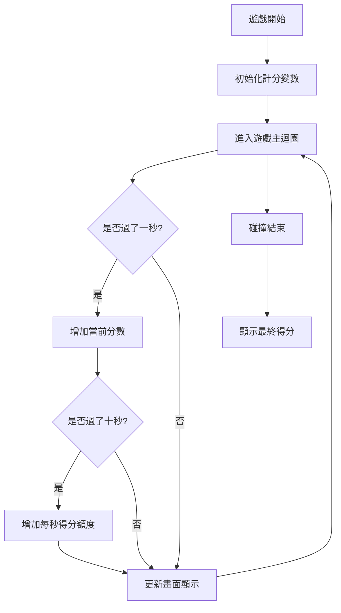
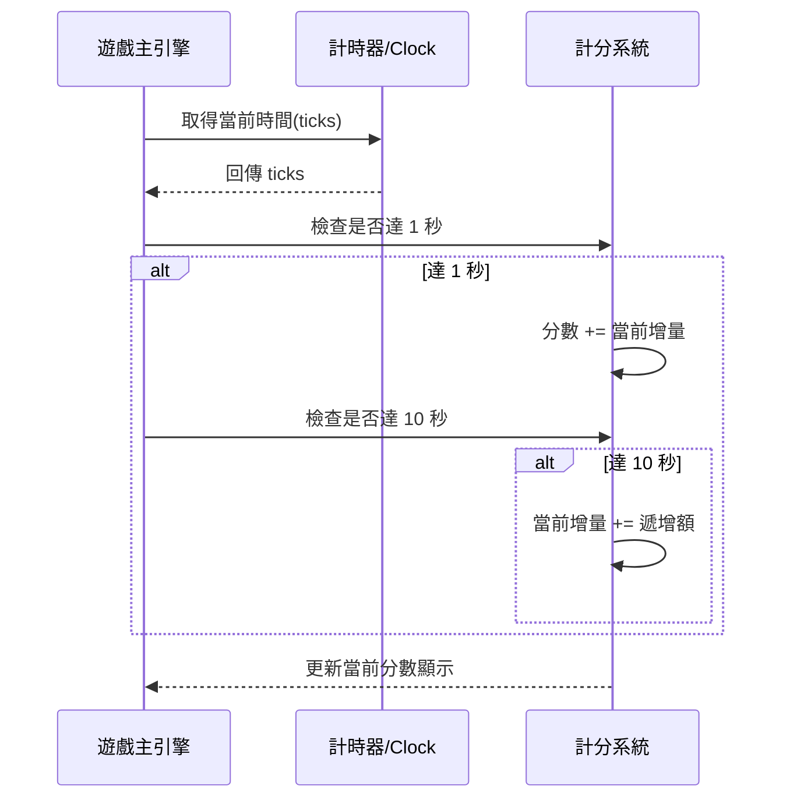
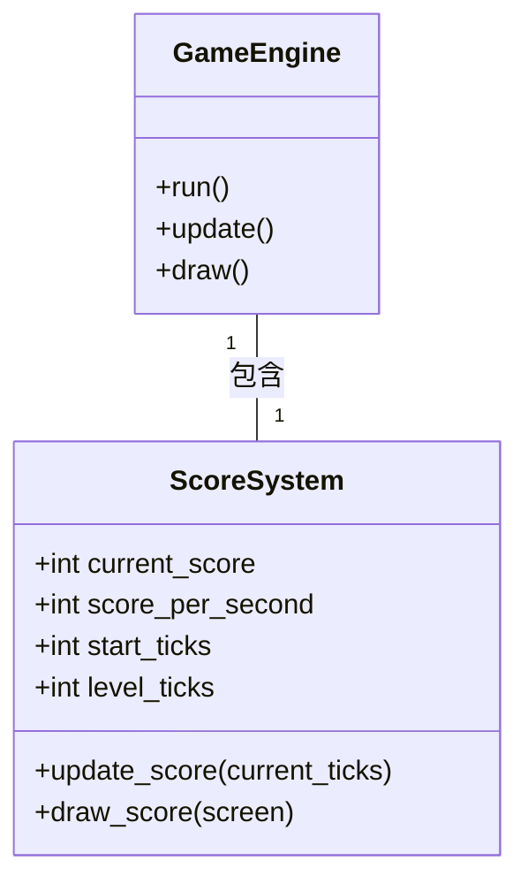

# 忍者必須活 - 計分系統規格文件 (Score System Specification)

## 1. 功能描述
- **基礎計分**：玩家每存活 1 秒（1000 毫秒），分數增加。
- **成長計分**：每過 10 秒，每秒增加的分數額度會遞增（例如：前 10 秒每秒 +10，第 11-20 秒每秒 +20，依此類推）。
- **畫面顯示**：在遊戲畫面左上角顯示目前的分數與當前每秒得分。

## 2. 系統流程圖

## 3. 循序圖

## 4. 物件關聯圖 (UML)

## 5. 實作細節
- `score`: `int`，初始為 0。
- `increase_rate`: `int`，基礎每秒增加 10 分。
- `increase_step`: `int`，每 10 秒增加 10 分額外增量。
- `last_score_tick`: `int`，記錄上次計分的時間。
- `last_level_tick`: `int`，記錄上次提升增量的時間。