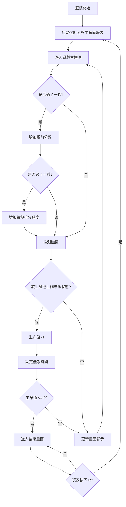
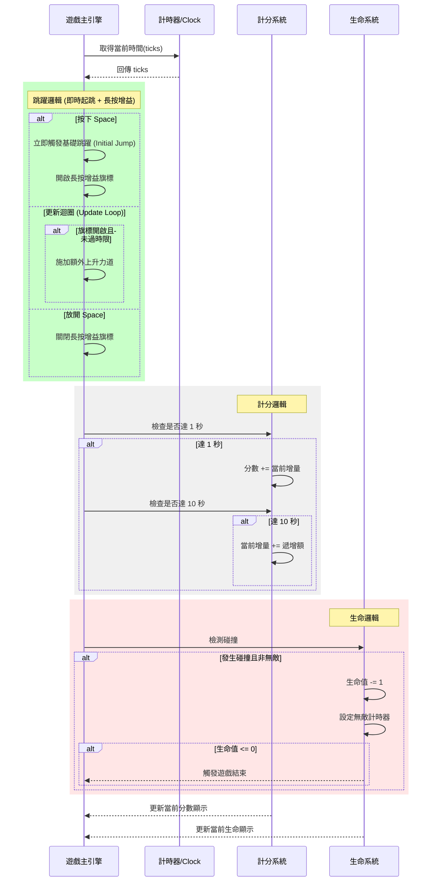
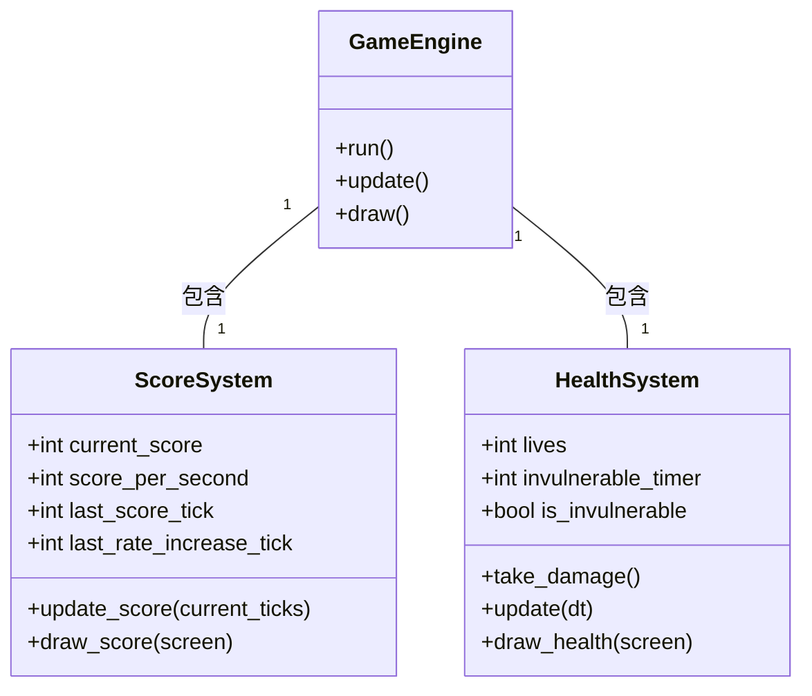

# 忍者必須活 - 系統規格文件 (System Specification)

## 1. 功能描述
- **基礎計分**：玩家每存活 1 秒（1000 毫秒），分數增加。
- **成長計分**：每過 10 秒，每秒增加的分數額度會遞增（例如：前 10 秒每秒 +10，第 11-20 秒每秒 +20，依此類推）。
- **生命值系統**：玩家初始有 3 顆心（生命值）。
- **碰撞機制**：當玩家觸碰到障礙物時，減少一顆心，並提供短暫的無敵時間防止連續扣血。
- **死亡機制**：當生命值歸零時，遊戲切換至「結束畫面」。
- **遊戲重啟**：在結束畫面中提供「重新開始」功能（例如按下 R 鍵或對應圖標）。
- **多樣化障礙物**：障礙物不再是簡單的矩形，而是隨機出現「手裏劍 (shuriken)」或「苦無 (kunai)」圖片。素材已由原先的 JPG 格式升級為 PNG 格式（支援透明度處理）。
- **畫面顯示**：
    - 左上角顯示目前的分數與當前每秒得分。
    - 分數下方顯示剩餘生命值（心形圖標或文字）。
    - 遊戲結束畫面：中央顯示 "GAME OVER"，下方顯示最終得分與 "按 R 重新開始"。
- **靈活跳躍控制**：
    - 玩家按下空白鍵時**立即起跳**。
    - 起跳後若持續按住空白鍵，角色會獲得額外的向上推力（長按增益），使跳躍高度更高。
    - 增益有最大時間限制（約 350 毫秒），超過時間或放開按鍵即停止增益。

## 2. 系統流程圖

## 3. 循序圖

## 4. 物件關聯圖 (UML)

## 5. 實作細節
- **計分系統**：
    - `score`: `int`，初始為 0。
    - `increase_rate`: `int`，基礎每秒增加 10 分。
    - `increase_step`: `int`，每 10 秒增加 10 分額外增量。
- **生命值系統**：
    - `lives`: `int`，初始為 3。
    - `invincible_duration`: `int`，受到傷害後的無敵時間（例如 1500 毫秒）。
    - `last_damage_tick`: `int`，記錄上次受傷的時間，用於計算無敵狀態。